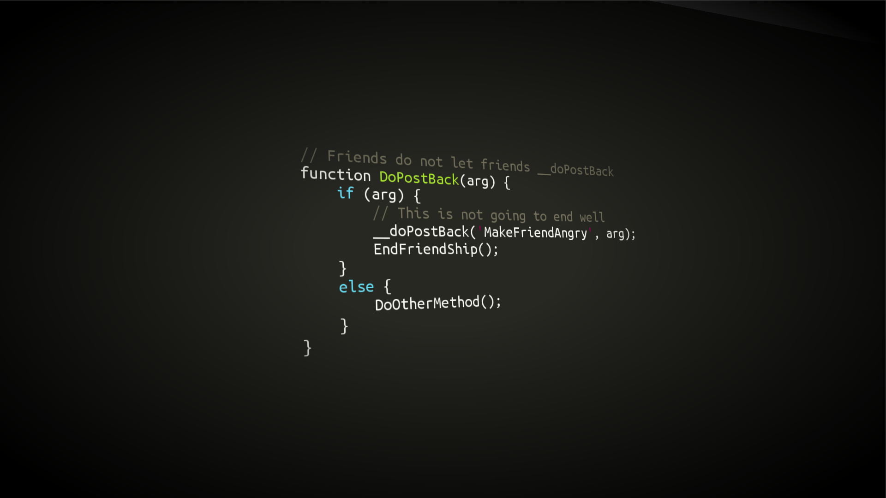

[Home](./index.markdown) | [About](./about.markdown) | [Work Experience](./work-experience.markdown) | [Projects](./projects.md) | [Skills](./skills.md)

# About Me

Hi! I'm **Camilo Martínez Rincon**, a Software Developer with over 5 years of experience building enterprise-level systems, scalable backend architectures, and modern web applications.

I specialize in:

- Backend architecture with **Java + Spring Boot** and **Node.js + TypeScript**  
- Cloud services using **AWS (Lambda, SNS, DynamoDB, KMS)**  
- Front-end development with **Angular 17** and **React**  
- Automation and DevOps using **CI/CD**, Docker, and Terraform  
- Relational databases such as Oracle and MySQL  

I am passionate about writing clean, scalable code and collaborating in Agile engineering teams.

---